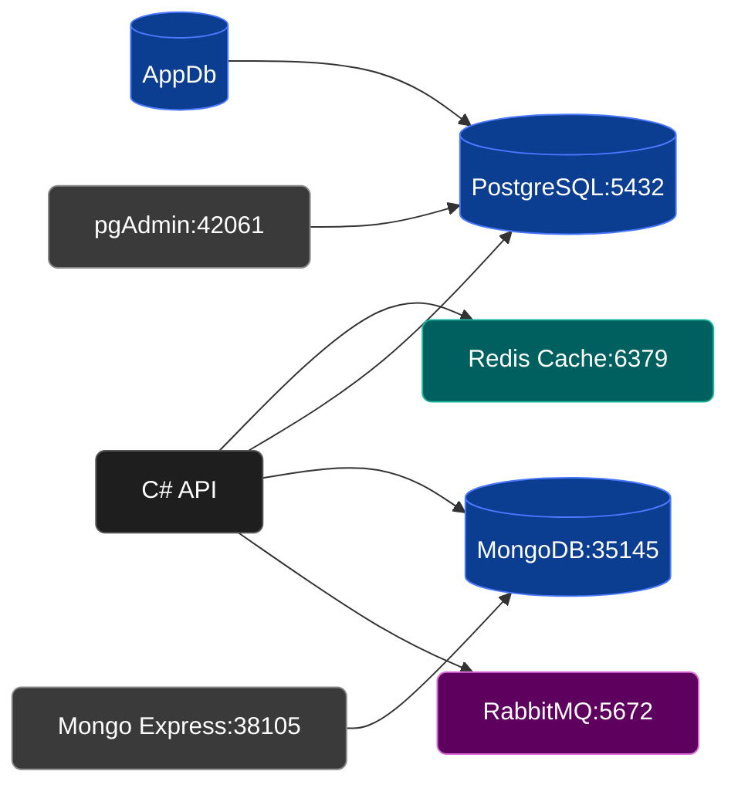

> [!CAUTION]
> This project is made only with the purposal for study Dotnet Aspire, RabbitMq and some clean archtecture concepts, this isn't planned as production ready app.

## Requirements
- .Net 10
- Docker

## Running the project locally
1. Having docker and dotnet 10 installed, just go to AppHost folder `cd AppHost`
2. Execute the application and dotnet aspire will take charge about running and orchestrating the containers `dotnet run`
3. 🔥🔥LFG🔥🔥

> [!INFO]
> Since the application is running at development enviorment, the application will auto apply migrations in the database, so you can just access `https://localhost:7281/scalar/v1` to get the Open API documentation.

## High level archtecture

- In this project mongo is used only for store structured logs and nothing more...
- PostgreSQL is the database for storage persistent data, for viewing data the application get an pgAdmin container up
- Redis (Valkey) is the cache layer
- RabbitMQ for async processing using persitent channels